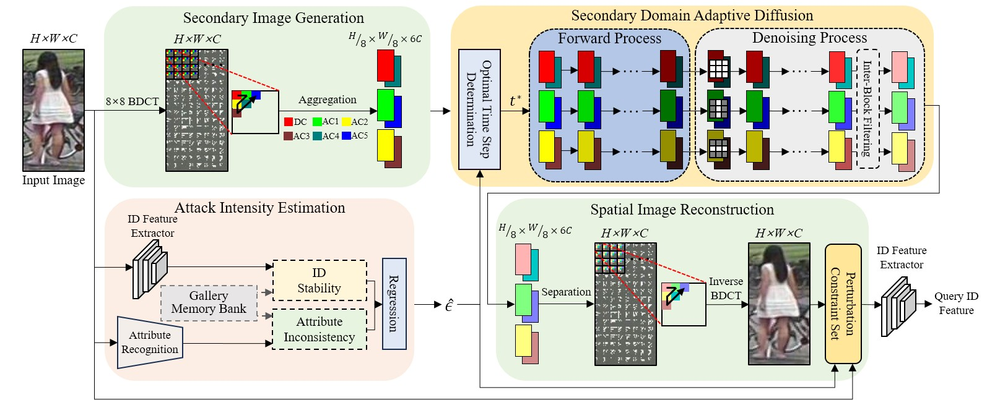

# IntensPure: Attack Intensity-aware Secondary Domain Adaptive Diffusion for Adversarial Purification

Eun-Gi Lee, Moon Seok Lee, Jae Hyun Yoon and Seok Bong Yoo*

(Abstract) Adversarial attacks pose a severe threat to the accuracy of person re-identification (re-ID) systems, a critical security technology. Adversarial purification methods are promising approaches for defending against comprehensive attacks, including unseen ones. However, re-ID testing identities (IDs) are unseen, requiring more sophisticated purification than other classification tasks for adversarial defense. We propose IntensPure, an adversarial purification method in person re-ID that quantifies attack intensity via ID stability and attribute inconsistency to customize purification strength. Based on the estimated attack intensity, IntensPure employs secondary domain adaptive diffusion focused on purifying the low- and mid-frequency coefficients vulnerable to re-ID attacks. This method significantly reduces computational costs compared to the conventional diffusion method. For elaborate purification, IntensPure performs a directional diffusion process and refinements, leveraging the directional characteristics of secondary images. The experimental results on diverse attacks demonstrate that IntensPure outperforms the existing methods in terms of rank-1 accuracy.

The papaer presented at [IJCAI2024](https://ijcai24.org/).

  

## Datasets
Market-1501: https://zheng-lab.cecs.anu.edu.au/Project/project_reid.html

## Pre-trained weight
Person re-ID: [https://github.com/layumi/Person_reID_baseline_pytorch/blob/master/tutorial/README.md](https://github.com/layumi/Person_reID_baseline_pytorch/tree/master)

### Train
python [IntensPure.py](IntensPure.py)  -p train

### Test 
python [IntensPure.py](IntensPure.py) -p test.
